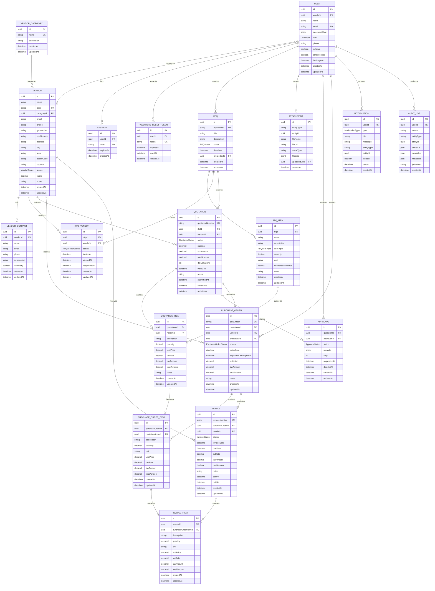
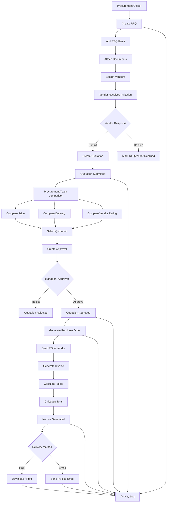
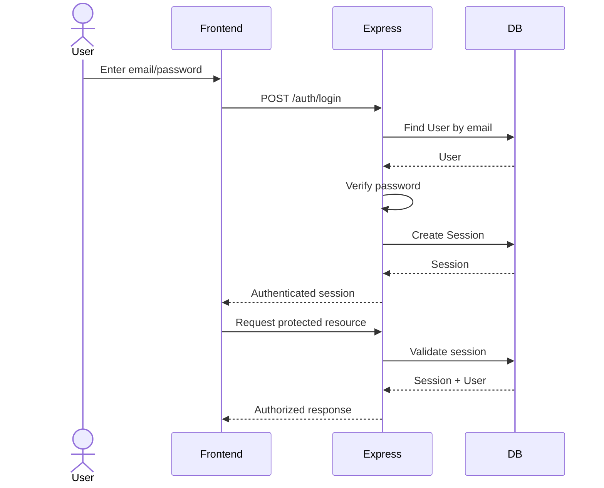
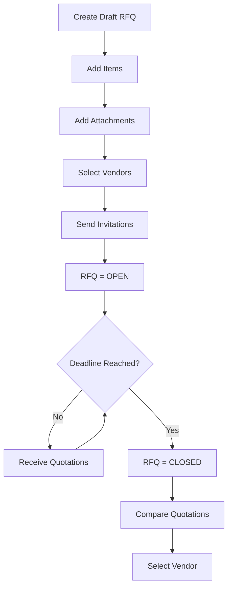
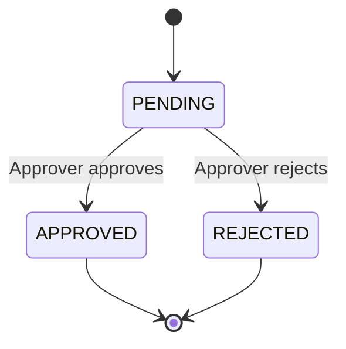
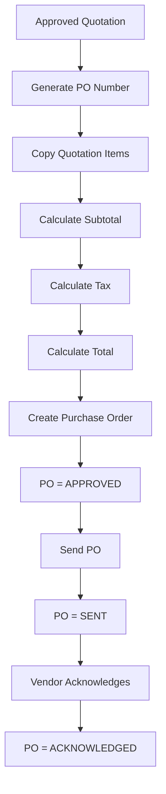
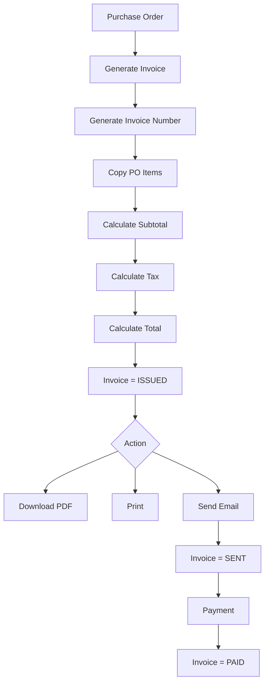
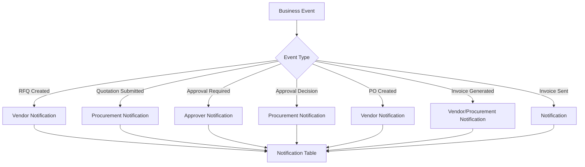

# VendorBridge Database Schema & Implementation Guide

## 1. Document Purpose

This document defines the complete database architecture for **VendorBridge**, a single-company Procurement & Vendor Management ERP.

The schema is designed for:

* **PostgreSQL**
* **Prisma ORM**
* **Express.js backend**
* REST APIs
* Role-based authentication
* Procurement workflow management
* Vendor management
* RFQs
* Quotations
* Quotation comparison
* Approval workflows
* Purchase orders
* Invoices
* Notifications
* Audit logs
* Procurement analytics

The database is intentionally designed for **one company only**. There is no `Organization` or multi-tenant layer.

The source requirements define VendorBridge around vendors, RFQs, quotations, approvals, purchase orders, invoices, procurement tracking, notifications, audit logs, and analytics.

---

# 2. Core Architecture

The database contains the following entities:

```text
Authentication
├── User
├── Session
└── PasswordResetToken

Vendor Management
├── Vendor
├── VendorCategory
└── VendorContact

Procurement
├── RFQ
├── RFQItem
├── RFQVendor
├── Attachment
├── Quotation
└── QuotationItem

Approval & Fulfillment
├── Approval
├── PurchaseOrder
├── PurchaseOrderItem
├── Invoice
└── InvoiceItem

System
├── Notification
└── AuditLog
```

Total:

**18 tables**

---

# 3. ER Diagram



---

# 4. Authentication Tables

## 4.1 User

Purpose:

Stores every person who can access VendorBridge.

### Fields

| Field             | Type     | Required | Description                          |
| ----------------- | -------- | -------: | ------------------------------------ |
| `id`            | UUID     |      Yes | Primary key                          |
| `vendorId`      | UUID     |       No | Vendor associated with a vendor user |
| `name`          | String   |      Yes | User's full name                     |
| `email`         | String   |      Yes | Login email                          |
| `passwordHash`  | String   |      Yes | Hashed password                      |
| `role`          | Enum     |      Yes | User role                            |
| `phone`         | String   |       No | Contact number                       |
| `isActive`      | Boolean  |      Yes | Whether account is active            |
| `emailVerified` | Boolean  |      Yes | Whether email is verified            |
| `lastLoginAt`   | DateTime |       No | Last successful login                |
| `createdAt`     | DateTime |      Yes | Creation timestamp                   |
| `updatedAt`     | DateTime |      Yes | Last update                          |

### Roles

```text
ADMIN
PROCUREMENT_OFFICER
APPROVER
VENDOR
```

### Rules

* Email must be unique.
* Store only password hashes.
* Never store plaintext passwords.
* Vendor users may have `vendorId`.
* Internal users have `vendorId = null`.

---

# 5. Session

Purpose:

Persistent authentication/session handling.

| Field         | Type     |
| ------------- | -------- |
| `id`        | UUID     |
| `userId`    | UUID     |
| `token`     | String   |
| `expiresAt` | DateTime |
| `createdAt` | DateTime |

Rules:

* `token` must be unique.
* Expired sessions should be rejected.
* Sessions should be deleted/revoked on logout.

---

# 6. PasswordResetToken

Purpose:

Forgot-password workflow.

| Field         | Type              |
| ------------- | ----------------- |
| `id`        | UUID              |
| `userId`    | UUID              |
| `token`     | String            |
| `expiresAt` | DateTime          |
| `usedAt`    | DateTime nullable |
| `createdAt` | DateTime          |

A token is valid when:

```text
expiresAt > current time
AND
usedAt IS NULL
```

After password reset:

```text
usedAt = current timestamp
```

---

# 7. Vendor Management

## 7.1 Vendor

Stores the organization's vendors.

| Field          | Type         | Required |
| -------------- | ------------ | -------: |
| `id`         | UUID         |      Yes |
| `name`       | String       |      Yes |
| `code`       | String       |      Yes |
| `categoryId` | UUID         |      Yes |
| `email`      | String       |      Yes |
| `phone`      | String       |      Yes |
| `gstNumber`  | String       |       No |
| `panNumber`  | String       |       No |
| `address`    | String       |       No |
| `city`       | String       |       No |
| `state`      | String       |       No |
| `postalCode` | String       |       No |
| `country`    | String       |      Yes |
| `status`     | VendorStatus |      Yes |
| `rating`     | Decimal      |       No |
| `notes`      | String       |       No |
| `createdAt`  | DateTime     |      Yes |
| `updatedAt`  | DateTime     |      Yes |

### VendorStatus

```text
PENDING
ACTIVE
INACTIVE
SUSPENDED
```

### Vendor rating

Use a decimal such as:

```text
4.50
```

rather than an integer.

Recommended range:

```text
0.00 → 5.00
```

---

# 8. VendorCategory

| Field           | Type            |
| --------------- | --------------- |
| `id`          | UUID            |
| `name`        | String          |
| `description` | String nullable |
| `createdAt`   | DateTime        |
| `updatedAt`   | DateTime        |

Example categories:

```text
IT Equipment
Office Supplies
Raw Materials
Professional Services
Logistics
```

---

# 9. VendorContact

Allows multiple contacts for one vendor.

| Field           | Type     |
| --------------- | -------- |
| `id`          | UUID     |
| `vendorId`    | UUID     |
| `name`        | String   |
| `email`       | String   |
| `phone`       | String   |
| `designation` | String   |
| `isPrimary`   | Boolean  |
| `createdAt`   | DateTime |
| `updatedAt`   | DateTime |

---

# 10. RFQ

RFQ = Request for Quotation.

This is the starting point of procurement.

| Field           | Type      | Description                |
| --------------- | --------- | -------------------------- |
| `id`          | UUID      | Primary key                |
| `rfqNumber`   | String    | Human-readable RFQ number  |
| `title`       | String    | RFQ title                  |
| `description` | String    | Overall requirements       |
| `status`      | RFQStatus | Workflow state             |
| `deadline`    | DateTime  | Vendor submission deadline |
| `createdById` | UUID      | Procurement officer        |
| `createdAt`   | DateTime  | Creation time              |
| `updatedAt`   | DateTime  | Last update                |

### RFQStatus

```text
DRAFT
OPEN
CLOSED
UNDER_REVIEW
AWAITING_APPROVAL
APPROVED
REJECTED
CANCELLED
```

### Example

```text
RFQ-2026-0012
────────────────────
Title: Office Laptop Procurement
Status: OPEN
Deadline: 2026-08-25
Created By: Procurement Officer
```

---

# 11. RFQItem

One RFQ can contain multiple products/services.

| Field                  | Type             |
| ---------------------- | ---------------- |
| `id`                 | UUID             |
| `rfqId`              | UUID             |
| `name`               | String           |
| `description`        | String           |
| `itemType`           | Enum             |
| `quantity`           | Decimal          |
| `unit`               | String           |
| `estimatedUnitPrice` | Decimal nullable |
| `notes`              | String nullable  |
| `createdAt`          | DateTime         |
| `updatedAt`          | DateTime         |

### RFQItemType

```text
PRODUCT
SERVICE
```

Example:

```text
RFQ
 ├── 20 × Laptop
 ├── 20 × Monitor
 └── 20 × Keyboard
```

---

# 12. RFQVendor

Connects RFQs and Vendors.

```text
RFQ ←──── RFQVendor ────→ Vendor
```

| Field           | Type              |
| --------------- | ----------------- |
| `id`          | UUID              |
| `rfqId`       | UUID              |
| `vendorId`    | UUID              |
| `status`      | RFQVendorStatus   |
| `invitedAt`   | DateTime          |
| `viewedAt`    | DateTime nullable |
| `respondedAt` | DateTime nullable |
| `createdAt`   | DateTime          |
| `updatedAt`   | DateTime          |

### RFQVendorStatus

```text
INVITED
VIEWED
SUBMITTED
DECLINED
EXPIRED
```

### Constraint

```text
UNIQUE(rfqId, vendorId)
```

One vendor should not receive the same RFQ twice.

---

# 13. Attachment

Attachments are polymorphic so they can belong to different business entities.

| Field            | Type     |
| ---------------- | -------- |
| `id`           | UUID     |
| `entityType`   | String   |
| `entityId`     | UUID     |
| `fileName`     | String   |
| `fileUrl`      | String   |
| `mimeType`     | String   |
| `fileSize`     | BigInt   |
| `uploadedById` | UUID     |
| `createdAt`    | DateTime |

Example:

```text
entityType = "RFQ"
entityId   = "..."
```

The file itself should live in object storage. The database stores the metadata and URL.

---

# 14. Quotation

A quotation represents a vendor's response to an RFQ.

| Field               | Type              |
| ------------------- | ----------------- |
| `id`              | UUID              |
| `quotationNumber` | String            |
| `rfqId`           | UUID              |
| `vendorId`        | UUID              |
| `status`          | QuotationStatus   |
| `subtotal`        | Decimal           |
| `taxAmount`       | Decimal           |
| `totalAmount`     | Decimal           |
| `deliveryDays`    | Integer           |
| `validUntil`      | DateTime          |
| `notes`           | String            |
| `submittedAt`     | DateTime nullable |
| `createdAt`       | DateTime          |
| `updatedAt`       | DateTime          |

### QuotationStatus

```text
DRAFT
SUBMITTED
UNDER_REVIEW
SELECTED
REJECTED
EXPIRED
```

---

# 15. QuotationItem

| Field           | Type     |
| --------------- | -------- |
| `id`          | UUID     |
| `quotationId` | UUID     |
| `rfqItemId`   | UUID     |
| `description` | String   |
| `quantity`    | Decimal  |
| `unitPrice`   | Decimal  |
| `taxRate`     | Decimal  |
| `taxAmount`   | Decimal  |
| `totalAmount` | Decimal  |
| `notes`       | String   |
| `createdAt`   | DateTime |
| `updatedAt`   | DateTime |

This table powers quotation comparison.

Example:

```text
RFQ Item
   ↓
Quotation Item
   ├── Vendor A price
   ├── Vendor B price
   └── Vendor C price
```

---

# 16. Approval

Approvals belong to quotations.

| Field           | Type              |
| --------------- | ----------------- |
| `id`          | UUID              |
| `quotationId` | UUID              |
| `approverId`  | UUID              |
| `status`      | ApprovalStatus    |
| `remarks`     | String            |
| `step`        | Integer           |
| `requestedAt` | DateTime          |
| `decidedAt`   | DateTime nullable |
| `createdAt`   | DateTime          |
| `updatedAt`   | DateTime          |

### ApprovalStatus

```text
PENDING
APPROVED
REJECTED
```

Although the hackathon can use one approval step, keeping `step` allows future multi-step workflows.

---

# 17. PurchaseOrder

Created from an approved quotation.

| Field                    | Type                |
| ------------------------ | ------------------- |
| `id`                   | UUID                |
| `poNumber`             | String              |
| `quotationId`          | UUID                |
| `vendorId`             | UUID                |
| `createdById`          | UUID                |
| `status`               | PurchaseOrderStatus |
| `orderDate`            | DateTime            |
| `expectedDeliveryDate` | DateTime            |
| `subtotal`             | Decimal             |
| `taxAmount`            | Decimal             |
| `totalAmount`          | Decimal             |
| `notes`                | String              |
| `createdAt`            | DateTime            |
| `updatedAt`            | DateTime            |

### PurchaseOrderStatus

```text
DRAFT
PENDING_APPROVAL
APPROVED
SENT
ACKNOWLEDGED
PARTIALLY_RECEIVED
COMPLETED
CANCELLED
```

---

# 18. PurchaseOrderItem

| Field               | Type     |
| ------------------- | -------- |
| `id`              | UUID     |
| `purchaseOrderId` | UUID     |
| `quotationItemId` | UUID     |
| `description`     | String   |
| `quantity`        | Decimal  |
| `unit`            | String   |
| `unitPrice`       | Decimal  |
| `taxRate`         | Decimal  |
| `taxAmount`       | Decimal  |
| `totalAmount`     | Decimal  |
| `createdAt`       | DateTime |
| `updatedAt`       | DateTime |

---

# 19. Invoice

Invoice is generated from the Purchase Order.

| Field               | Type              |
| ------------------- | ----------------- |
| `id`              | UUID              |
| `invoiceNumber`   | String            |
| `purchaseOrderId` | UUID              |
| `vendorId`        | UUID              |
| `status`          | InvoiceStatus     |
| `invoiceDate`     | DateTime          |
| `dueDate`         | DateTime          |
| `subtotal`        | Decimal           |
| `taxAmount`       | Decimal           |
| `totalAmount`     | Decimal           |
| `notes`           | String            |
| `sentAt`          | DateTime nullable |
| `paidAt`          | DateTime nullable |
| `createdAt`       | DateTime          |
| `updatedAt`       | DateTime          |

### InvoiceStatus

```text
DRAFT
ISSUED
SENT
PAID
OVERDUE
CANCELLED
```

---

# 20. InvoiceItem

| Field                   | Type     |
| ----------------------- | -------- |
| `id`                  | UUID     |
| `invoiceId`           | UUID     |
| `purchaseOrderItemId` | UUID     |
| `description`         | String   |
| `quantity`            | Decimal  |
| `unit`                | String   |
| `unitPrice`           | Decimal  |
| `taxRate`             | Decimal  |
| `taxAmount`           | Decimal  |
| `totalAmount`         | Decimal  |
| `createdAt`           | DateTime |
| `updatedAt`           | DateTime |

---

# 21. Notification

| Field          | Type              |
| -------------- | ----------------- |
| `id`         | UUID              |
| `userId`     | UUID              |
| `type`       | NotificationType  |
| `title`      | String            |
| `message`    | String            |
| `entityType` | String nullable   |
| `entityId`   | UUID nullable     |
| `isRead`     | Boolean           |
| `readAt`     | DateTime nullable |
| `createdAt`  | DateTime          |

### NotificationType

```text
RFQ_INVITATION
QUOTATION_SUBMITTED
APPROVAL_REQUIRED
APPROVAL_APPROVED
APPROVAL_REJECTED
PO_CREATED
PO_SENT
INVOICE_GENERATED
INVOICE_SENT
INVOICE_STATUS_UPDATED
SYSTEM
```

---

# 22. AuditLog

| Field          | Type     |
| -------------- | -------- |
| `id`         | UUID     |
| `userId`     | UUID     |
| `action`     | String   |
| `entityType` | String   |
| `entityId`   | UUID     |
| `oldValue`   | JSON     |
| `newValue`   | JSON     |
| `metadata`   | JSON     |
| `ipAddress`  | String   |
| `createdAt`  | DateTime |

Example:

```json
{
  "action": "APPROVAL_STATUS_CHANGED",
  "entityType": "APPROVAL",
  "oldValue": {
    "status": "PENDING"
  },
  "newValue": {
    "status": "APPROVED"
  }
}
```

Audit logs should be append-only.

---

# 23. Complete Business Workflow

The core VendorBridge workflow is:



---

# 24. Authentication Flow



---

# 25. Forgot Password Flow

```mermaid
flowchart LR

    A[Forgot Password] --> B[Enter Email]
    B --> C[Find User]
    C --> D[Generate Reset Token]
    D --> E[Store Token]
    E --> F[Send Reset Email]
    F --> G[User Opens Link]
    G --> H[Validate Token]
    H --> I[Set New Password]
    I --> J[Mark Token Used]
    J --> K[Login]
```



---

# 26. RFQ Flow



---

# 27. Quotation Comparison Flow

The comparison screen should be generated from:

```text
RFQ
├── RFQItems
├── RFQVendors
└── Quotations
    └── QuotationItems
```

The API should return a comparison structure similar to:

```text
RFQ
 ├── Item 1
 │    ├── Vendor A → ₹50,000
 │    ├── Vendor B → ₹48,000
 │    └── Vendor C → ₹52,000
 │
 ├── Item 2
 │    ├── Vendor A → ₹10,000
 │    ├── Vendor B → ₹9,500
 │    └── Vendor C → ₹11,000
 │
 └── Summary
      ├── Total
      ├── Delivery
      └── Rating
```

**Lowest price should be calculated from quotation data rather than stored as a separate boolean.**

Do not create:

```text
isLowestPrice
```

in the database.

That is derived information.

---

# 28. Approval Workflow



When approval is approved:

```text
Approval
   ↓
Quotation.status = SELECTED
   ↓
Generate PurchaseOrder
```

When rejected:

```text
Approval.status = REJECTED
Quotation.status = REJECTED
```

Every transition should generate an `AuditLog`.

---

# 29. Purchase Order Flow



---

# 30. Invoice Flow



The requirements specifically include PDF download, printing and sending invoices through email.

---

# 31. Notification Flow

Notifications should be created as side effects of business events.



---

# 32. Audit Flow

Every important mutation should generate an audit record.

Examples:

```text
RFQ_CREATED
RFQ_UPDATED
RFQ_SENT
RFQ_CANCELLED

QUOTATION_CREATED
QUOTATION_SUBMITTED
QUOTATION_SELECTED
QUOTATION_REJECTED

APPROVAL_CREATED
APPROVAL_APPROVED
APPROVAL_REJECTED

PO_CREATED
PO_APPROVED
PO_SENT
PO_CANCELLED

INVOICE_CREATED
INVOICE_SENT
INVOICE_PAID
```

The audit record should contain:

```text
Who?
What?
Which entity?
What changed?
When?
From where?
```

---

# 33. Dashboard Data

The dashboard does **not** need its own database table.

It should derive information from existing tables.

### Pending approvals

```text
Approval
WHERE status = PENDING
```

### Active RFQs

```text
RFQ
WHERE status = OPEN
```

### Recent purchase orders

```text
PurchaseOrder
ORDER BY createdAt DESC
LIMIT 5
```

### Recent invoices

```text
Invoice
ORDER BY createdAt DESC
LIMIT 5
```

### Analytics cards

Examples:

```text
Total Vendors
Active RFQs
Pending Approvals
Total Purchase Orders
Total Invoiced Amount
Pending Invoice Amount
```

These are calculated queries.

---

# 34. Reports & Analytics

The requirements include:

* Vendor performance analytics
* Exportable reports
* Procurement statistics
* Spending summaries
* Monthly procurement trends.

These should initially be derived from the transactional tables.

### Monthly spending

Use:

```text
Invoice.totalAmount
Invoice.invoiceDate
```

grouped by month.

### Vendor performance

Use:

```text
Vendor.rating
Quotation
QuotationItem
PurchaseOrder
Invoice
```

### Procurement statistics

Use:

```text
RFQ
Quotation
Approval
PurchaseOrder
Invoice
```

Do not create a redundant `Analytics` table for the hackathon.

---

# 35. Financial Data Rules

This is important.

## Never use Float for money.

Use:

```text
Decimal
```

for:

```text
estimatedUnitPrice
unitPrice
subtotal
taxAmount
taxRate
totalAmount
rating
```

Recommended PostgreSQL representation:

```text
Decimal(15,2)
```

for monetary values.

For tax rates:

```text
Decimal(5,2)
```

Example:

```text
18.00
```

for 18%.

---

# 36. Calculation Rules

For an item:

```text
lineSubtotal =
    quantity × unitPrice
```

Tax:

```text
taxAmount =
    lineSubtotal × taxRate / 100
```

Line total:

```text
totalAmount =
    lineSubtotal + taxAmount
```

Document subtotal:

```text
subtotal =
    SUM(item line subtotals)
```

Document tax:

```text
taxAmount =
    SUM(item tax amounts)
```

Document total:

```text
totalAmount =
    subtotal + taxAmount
```

The backend must be the source of truth for these calculations.

**Never trust totals sent by the frontend.**

---

# 37. Number Generation

Human-readable document numbers should be generated by the backend.

Examples:

```text
RFQ-2026-0001
RFQ-2026-0002

QT-2026-0001
QT-2026-0002

PO-2026-0001
PO-2026-0002

INV-2026-0001
INV-2026-0002
```

The database should enforce uniqueness.

The frontend should never generate these numbers.

---

# 38. Delete Rules

Do not casually hard-delete procurement records.

For example:

```text
RFQ
Quotation
Approval
PurchaseOrder
Invoice
AuditLog
```

should generally remain for historical tracking.

Instead use statuses such as:

```text
CANCELLED
INACTIVE
REJECTED
```

### Safe deletion

Users:

```text
isActive = false
```

Vendors:

```text
status = INACTIVE
```

RFQs:

```text
status = CANCELLED
```

This preserves ERP history.

---

# 39. Cascade Rules

Recommended:

```text
User
 └── Session
      → CASCADE

User
 └── PasswordResetToken
      → CASCADE

Vendor
 └── VendorContact
      → CASCADE

RFQ
 └── RFQItem
      → CASCADE

RFQ
 └── RFQVendor
      → CASCADE
```

But do **not** cascade-delete historical procurement documents.

For example:

```text
Quotation → PurchaseOrder
PurchaseOrder → Invoice
```

should use restrictive behavior.

Historical financial records must not disappear because someone deletes a parent record.

---

# 40. Indexing Strategy

Create indexes on frequently queried fields.

### User

```text
email UNIQUE
```

### Vendor

```text
code UNIQUE
gstNumber
status
categoryId
name
```

### RFQ

```text
rfqNumber UNIQUE
status
deadline
createdById
createdAt
```

### RFQVendor

```text
rfqId
vendorId
status

UNIQUE(rfqId, vendorId)
```

### Quotation

```text
quotationNumber UNIQUE
rfqId
vendorId
status
createdAt
```

### Approval

```text
quotationId
approverId
status
```

### PurchaseOrder

```text
poNumber UNIQUE
quotationId
vendorId
status
createdAt
```

### Invoice

```text
invoiceNumber UNIQUE
purchaseOrderId
vendorId
status
invoiceDate
```

### Notification

```text
userId
isRead
createdAt
```

### AuditLog

```text
userId
entityType
entityId
createdAt
```

---

# 41. Prisma Implementation Structure

The backend should keep Prisma isolated inside the data-access layer.

Recommended:

```text
backend/
│
├── src/
│   │
│   ├── config/
│   │   ├── env.ts
│   │   └── constants.ts
│   │
│   ├── lib/
│   │   └── prisma.ts
│   │
│   ├── middleware/
│   │   ├── auth.middleware.ts
│   │   ├── role.middleware.ts
│   │   ├── error.middleware.ts
│   │   └── validation.middleware.ts
│   │
│   ├── modules/
│   │   │
│   │   ├── auth/
│   │   ├── users/
│   │   ├── vendors/
│   │   ├── rfqs/
│   │   ├── quotations/
│   │   ├── approvals/
│   │   ├── purchase-orders/
│   │   ├── invoices/
│   │   ├── notifications/
│   │   ├── audit/
│   │   └── reports/
│   │
│   ├── services/
│   │   ├── number-generator.service.ts
│   │   ├── notification.service.ts
│   │   ├── audit.service.ts
│   │   ├── pdf.service.ts
│   │   └── email.service.ts
│   │
│   ├── routes/
│   ├── app.ts
│   └── server.ts
│
├── prisma/
│   ├── schema.prisma
│   ├── seed.ts
│   └── migrations/
│
└── package.json
```

---

# 42. Prisma Schema Rules

The Prisma schema should follow these principles:

### IDs

Use UUIDs:

```prisma
id String @id @default(uuid()) @db.Uuid
```

### Timestamps

Use:

```prisma
createdAt DateTime @default(now())
updatedAt DateTime @updatedAt
```

### Optional values

Use Prisma nullable fields:

```prisma
phone String?
```

### Financial values

Use:

```prisma
Decimal
```

not:

```prisma
Float
```

### Enumerations

Define workflow statuses as Prisma enums rather than arbitrary strings.

---

# 43. Suggested Prisma Relation Strategy

Example conceptual relation:

```text
RFQ
 ├── createdBy → User
 ├── items → RFQItem[]
 ├── invitedVendors → RFQVendor[]
 └── quotations → Quotation[]
```

Quotation:

```text
Quotation
 ├── rfq → RFQ
 ├── vendor → Vendor
 ├── items → QuotationItem[]
 └── approvals → Approval[]
```

Purchase Order:

```text
PurchaseOrder
 ├── quotation → Quotation
 ├── vendor → Vendor
 ├── createdBy → User
 └── items → PurchaseOrderItem[]
```

Invoice:

```text
Invoice
 ├── purchaseOrder → PurchaseOrder
 ├── vendor → Vendor
 └── items → InvoiceItem[]
```

---

# 44. Backend Transaction Boundaries

Critical workflows should use Prisma transactions.

## Approving quotation

One transaction:

```text
BEGIN

Update Approval
Update Quotation
Create PurchaseOrder
Create PurchaseOrderItems
Create Notification
Create AuditLog

COMMIT
```

If anything fails:

```text
ROLLBACK
```

---

## Generating invoice

One transaction:

```text
BEGIN

Create Invoice
Create InvoiceItems
Update PurchaseOrder if required
Create Notification
Create AuditLog

COMMIT
```

This prevents partially-created procurement documents.

---

# 45. Role Permissions

## ADMIN

```text
Manage users
Manage vendors
View analytics
View procurement data
```

## PROCUREMENT_OFFICER

```text
Create RFQs
Edit RFQs
Assign vendors
View quotations
Compare quotations
Select quotations
Generate purchase orders
Generate invoices
```

## APPROVER

```text
View pending approvals
Approve procurement
Reject procurement
Add remarks
View workflow
```

## VENDOR

```text
View assigned RFQs
View RFQ details
Submit quotations
Edit draft quotations
Track RFQ status
View purchase orders
View invoices where permitted
```

These roles correspond to the role responsibilities defined in the problem statement.

---

# 46. API Modules Should Follow the Database

Recommended API structure:

```text
/api/auth
/api/users
/api/vendors
/api/vendor-categories

/api/rfqs
/api/rfqs/:id/items
/api/rfqs/:id/vendors
/api/rfqs/:id/attachments

/api/quotations
/api/quotations/:id/items
/api/quotations/:id/submit
/api/quotations/:id/compare

/api/approvals
/api/approvals/:id/approve
/api/approvals/:id/reject

/api/purchase-orders
/api/purchase-orders/:id/send

/api/invoices
/api/invoices/:id/pdf
/api/invoices/:id/send

/api/notifications
/api/audit-logs

/api/dashboard
/api/reports
```

---

# 47. Important Business Invariants

These rules must be enforced by the backend.

### RFQ

```text
Cannot open RFQ without at least one item.
Cannot send RFQ without at least one vendor.
Cannot submit quotation after deadline.
```

### Quotation

```text
Quotation must belong to the RFQ.
Quotation vendor must be assigned to the RFQ.
Quotation must contain valid items.
```

### Approval

```text
Only authorized approvers can approve/reject.
Rejected quotation cannot generate PO.
```

### Purchase Order

```text
Only approved quotations can generate PO.
One quotation should generate at most one PO.
```

### Invoice

```text
Invoice must belong to a PO.
One PO should generate at most one invoice for this initial implementation.
```

### Vendor

```text
Inactive/suspended vendors cannot receive new RFQs.
```

---

# 48. State Transition Rules

## RFQ

```text
DRAFT
  ↓
OPEN
  ↓
CLOSED
  ↓
UNDER_REVIEW
  ↓
AWAITING_APPROVAL
  ↓
APPROVED / REJECTED
```

Cancellation can happen before completion:

```text
DRAFT → CANCELLED
OPEN → CANCELLED
```

---

## Quotation

```text
DRAFT
  ↓
SUBMITTED
  ↓
UNDER_REVIEW
  ↓
SELECTED
```

or:

```text
UNDER_REVIEW
     ↓
  REJECTED
```

---

## Purchase Order

```text
DRAFT
 ↓
APPROVED
 ↓
SENT
 ↓
ACKNOWLEDGED
 ↓
COMPLETED
```

---

## Invoice

```text
DRAFT
 ↓
ISSUED
 ↓
SENT
 ↓
PAID
```

or:

```text
SENT → OVERDUE
```

---

# 49. Seed Data

The development database should have seed data for the demo.

Create:

### Users

```text
Admin
Procurement Officer
Approver
Vendor User
```

### Vendors

At least:

```text
3–5 vendors
```

### Categories

```text
IT Equipment
Office Supplies
Professional Services
```

### Procurement data

```text
2–3 RFQs
Multiple RFQ items
Multiple vendors per RFQ
Multiple quotations
Pending approval
Approved quotation
Purchase Order
Invoice
Notifications
Audit logs
```

This allows the dashboard and analytics screens to look populated immediately.

---

# 50. Recommended Implementation Order

Implement the database in this order:

```text
1. User
2. Session
3. PasswordResetToken

4. VendorCategory
5. Vendor
6. VendorContact

7. RFQ
8. RFQItem
9. RFQVendor
10. Attachment

11. Quotation
12. QuotationItem

13. Approval

14. PurchaseOrder
15. PurchaseOrderItem

16. Invoice
17. InvoiceItem

18. Notification
19. AuditLog
```

Then:

```text
Prisma migration
        ↓
Seed data
        ↓
Auth APIs
        ↓
Vendor APIs
        ↓
RFQ APIs
        ↓
Quotation APIs
        ↓
Approval APIs
        ↓
PO APIs
        ↓
Invoice APIs
        ↓
Notifications
        ↓
Audit logging
        ↓
Dashboard
        ↓
Reports
```

---

# 51. Database Implementation Checklist

Before considering the schema complete:

* [ ] PostgreSQL database configured
* [ ] Prisma installed
* [ ] Prisma client configured
* [ ] All 18 tables implemented
* [ ] All UUID primary keys implemented
* [ ] All required relationships implemented
* [ ] All enums implemented
* [ ] Unique constraints implemented
* [ ] Foreign keys implemented
* [ ] Indexes implemented
* [ ] Decimal used for financial values
* [ ] Created/updated timestamps implemented
* [ ] Session handling implemented
* [ ] Password reset implemented
* [ ] Role-based access implemented
* [ ] Vendor categories implemented
* [ ] Vendor contacts implemented
* [ ] RFQ items implemented
* [ ] RFQ vendor assignments implemented
* [ ] Attachments implemented
* [ ] Quotations implemented
* [ ] Quotation items implemented
* [ ] Approval workflow implemented
* [ ] Purchase orders implemented
* [ ] Purchase order items implemented
* [ ] Invoices implemented
* [ ] Invoice items implemented
* [ ] Notifications implemented
* [ ] Audit logs implemented
* [ ] Document number generation implemented
* [ ] Financial calculations implemented server-side
* [ ] Transaction boundaries implemented
* [ ] Seed data implemented
* [ ] RFQ → Quotation → Approval → PO → Invoice workflow tested
* [ ] Role permissions tested
* [ ] Invalid state transitions rejected
* [ ] Historical procurement records protected from accidental deletion

---

# 52. Final Architecture Decision

For this hackathon, the database architecture is:

```text
PostgreSQL
    │
    ▼
Prisma ORM
    │
    ▼
Express.js
    │
    ├── Auth
    ├── Vendors
    ├── RFQs
    ├── Quotations
    ├── Approvals
    ├── Purchase Orders
    ├── Invoices
    ├── Notifications
    ├── Audit
    └── Reports
```

The fundamental business chain is:

```text
User
  ↓
RFQ
  ↓
RFQ Items
  ↓
Vendor Invitations
  ↓
Quotations
  ↓
Quotation Items
  ↓
Approval
  ↓
Purchase Order
  ↓
Purchase Order Items
  ↓
Invoice
  ↓
Invoice Items
```

Everything else supports that chain:

```text
Sessions
Password Reset
Vendor Management
Attachments
Notifications
Audit Logs
Dashboard
Analytics
Reports
```

This keeps VendorBridge **single-company, relational, normalized, transaction-safe, Prisma-friendly, and directly aligned with the hackathon requirements**, without introducing multi-tenancy or unnecessary ERP modules.
